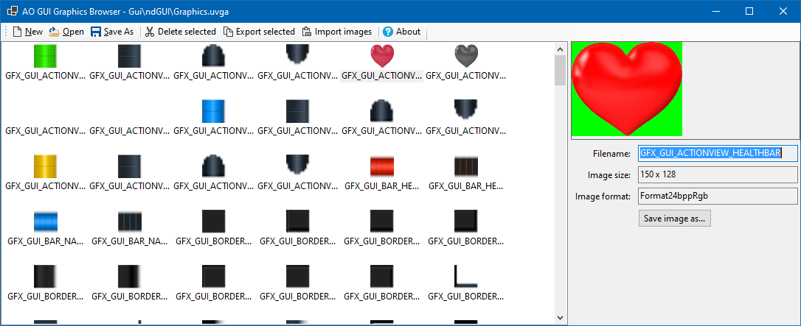

# LibUvga
**LibUvga** is a .NET Standard 2.0 library to open .UVGA/.UVGI file pairs that contain the images that are used to display the ingame GUI of the game Anarchy Online.

## Example 1: Loading a UVGA/I file
```C#
var fileName = @"C:\test\Graphics.uvgi";
var uvga = UvgaFile.Load(fileName);
foreach (UvgaImageContent image in uvga.Images)
{
    Console.WriteLine($"{image.Name} has {image.ImageData.Count} bytes of data.");
}
```
## Example 2: Creating and saving a new UVGA/I file
```C#
var uvga = new UvgaFile();
var imageData = File.ReadAllBytes(@"C:\test\image1.png"); // Should be 24bpp RGB PNG images
uvga.Images.Add(new UvgaImageContent("GFX_GUI_ACTIONVIEW_HEALTHBAR", imageData));
uvga.Save(@"C:\test\MyNewUVGA.uvgi"); // Extension is not important, it will create both MyNewUVGA.uvgi and MyNewUVGA.uvga
```

# UvgaExplorer
**UvgaExplorer** is a .NET 8.0 GUI application that allows editing the contents of the UVGA/UVGI file parts.
You can open existing files, export the contents, import images, or edit images in an external application by double-clicking them.

