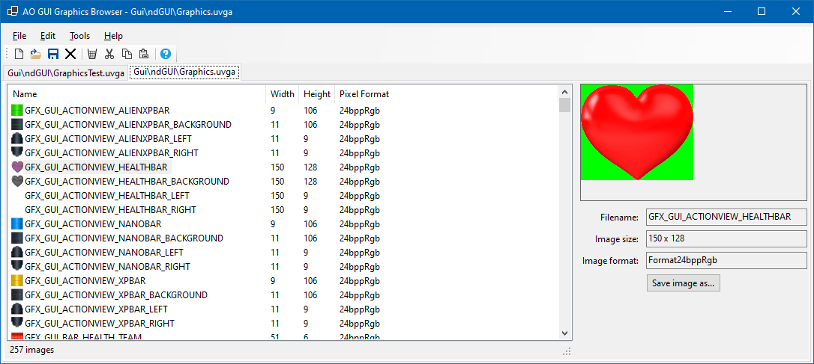

# UvgaExplorer
**UvgaExplorer** is a .NET 8.0 GUI application that allows editing the contents of the UVGA/UVGI file parts.
You can open existing files, export the contents, import images, or edit images in an external application by double-clicking them.



Features include:
- Open multiple UVGA/I files in the same application
- Free browsing of the images
- Import / Export functions incl. image format adjustment
- Copy / Paste or drag & drop between open files
- Drag & Drop interface with Windows explorer
- Open images in external editor by double-click with automatic re-import
- Automatic backup creation

**Please note:**
The default GUI is found in: `<AO Path>\cd_image\gui\Default`
Do not edit the UVGA/I files in there directly.
Instead do the following:

- Start the Anarchy Online Launcher, select `Settings -> GUI`
- Click the `Open` button next to `Skins`
- Copy the `Default` folder from `<AO Path>\cd_image\gui\Default` to the opened Skin folder
- Rename the copied folder to something else, e.g. `MyGui`, so you end up with `%localappdata%\Funcom\Anarchy Onnline\<hash>\<AO folder name>\Gui\MyGui`
- In the Anarchy Online launcher, in `Settings -> GUI` enter the folder name (e.g. `MyGui`) as the Skin name
- Close settings with OK.
- Then edit the UVGA/I files in the newly created folder instead.


Requirements:
Install the .NET 8 Desktop Runtime.

# LibUvga
**LibUvga** is a .NET Standard 2.0 library to open .UVGA/.UVGI file pairs that contain the images that are used to display the ingame GUI of the game Anarchy Online.

## Example 1: Loading a UVGA/I file
```C#
var fileName = @"C:\test\Graphics.uvgi";
var uvga = UvgaFile.Load(fileName);
foreach (UvgaImageContent image in uvga.Images)
{
    Console.WriteLine($"{image.Name} has {image.ImageData.Count} bytes of data.");
}
```
## Example 2: Creating and saving a new UVGA/I file
```C#
var uvga = new UvgaFile();
var imageData = File.ReadAllBytes(@"C:\test\image1.png"); // Should be 24bpp RGB PNG images
uvga.Images.Add(new UvgaImageContent("GFX_GUI_ACTIONVIEW_HEALTHBAR", imageData));
uvga.Save(@"C:\test\MyNewUVGA.uvgi", false); // Extension is not important, it will create both MyNewUVGA.uvgi and MyNewUVGA.uvga
```